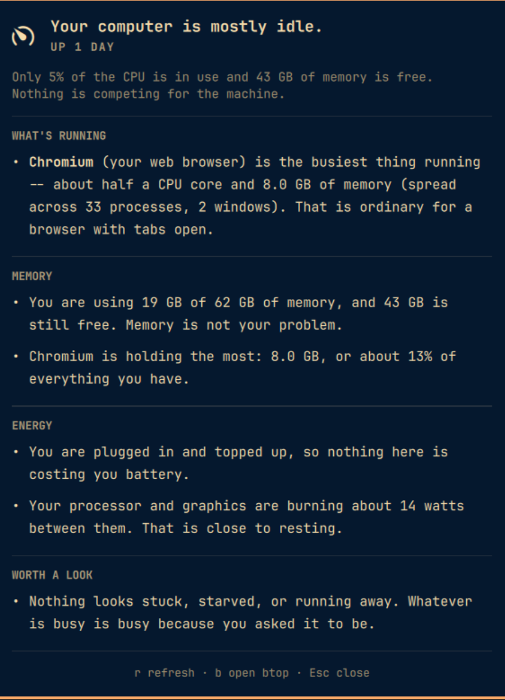

# Plain English

An Omarchy bar plugin that reads the same numbers `btop` shows you and says
what they mean.

`Super + Shift + T` opens btop, which tells you `bluetoothd 100.0 1686669 R`.
This tells you:

> **The Bluetooth service** (what manages your Bluetooth devices) is the
> busiest thing running — a whole CPU core and 8 MB of memory. This is a
> background service, not something you opened — it is supposed to sit idle.
> Using this much CPU means it is stuck, not busy.

A word in the bar (`Quiet`, `Busy`, `Working`, `Strained`, `Stuck`), and the
whole report when you click it.



## What it tells you

**What's running** — the handful of programs actually using the machine, named
in words rather than binaries, each with a line on whether that is normal.
A browser at two cores is ordinary; a background daemon at one core is stuck.
Processes are grouped by program, so Chrome's forty processes are one entry.

**Memory** — how much you are using, how much is left, whether that is
comfortable, and which program is holding the most.

**Energy** — battery percentage and real wattage where the hardware reports
it, how long that leaves you, what the CPU and GPU are burning, and how hot
things are running.

**Worth a look** — the section that answers "is anything actually wrong".
Reads the kernel's pressure-stall counters to catch the case where the CPU
looks idle but everything feels slow because programs are queued behind the
disk. Flags processes pegged for a long time, processes wedged on hardware,
and piles of zombies.

When nothing is wrong it says so plainly, which is the point: a monitor that
only ever shows numbers cannot tell you that you have nothing to worry about.

## Requirements

- Omarchy 4 (Quattro) with `omarchy-shell`
- Python 3 — already present on Arch; nothing else to install

No other dependencies, no root, and nothing is downloaded at runtime.

## Install

```bash
git clone https://github.com/joelgaff/omarchy-plain-english \
  ~/.config/omarchy/plugins/joelgaff.plain-english

omarchy-shell shell rescanPlugins
omarchy plugin enable joelgaff.plain-english
```

Move it in the bar with:

```bash
omarchy bar move joelgaff.plain-english --section right
```

## Update

```bash
git -C ~/.config/omarchy/plugins/joelgaff.plain-english pull
omarchy-shell shell rescanPlugins
```

## Remove

```bash
omarchy plugin disable joelgaff.plain-english
rm -rf ~/.config/omarchy/plugins/joelgaff.plain-english
omarchy-shell shell rescanPlugins
```

Disabling stops the helper process and takes the widget out of the bar.
Removing the directory leaves nothing behind: the plugin writes no config, no
cache, and no state outside its own folder, and it never edits your Omarchy
configuration. The only file it touches is `~/.config/omarchy/shell.json`,
and only through `omarchy plugin enable`/`disable` and `omarchy bar move` —
the same commands every plugin uses.

## Use

| Action | What it does |
|---|---|
| Left click | Open or close the report |
| Right click | Take a fresh reading now |
| Middle click | Open btop, for when you want the raw numbers after all |
| `r` | Refresh, while the panel is open |
| `b` | Open btop and close the panel |
| `Esc` | Close |

It can also be summoned from a keybinding or a script:

```bash
omarchy-shell joelgaff.plain-english toggle
```

To put that on a key, add to `~/.config/hypr/bindings.lua`:

```lua
o.bind("SUPER + ALT + T", "Activity in plain English",
  "omarchy-shell joelgaff.plain-english toggle")
```

## Settings

In the plugin's entry under `bar.layout` in `~/.config/omarchy/shell.json`:

| Key | Default | Meaning |
|---|---|---|
| `intervalSec` | `5` | Seconds between readings while the panel is open |
| `idleIntervalSec` | `15` | Seconds between readings while it is closed |
| `showLabel` | `true` | Show the state word beside the icon |

## Reading it from a terminal

All the judgement lives in one dependency-free Python script, so you can read
the same report without the bar — and disagree with its wording where it is
wrong:

```bash
./bin/plain-english-activity --text     # human-readable, once
./bin/plain-english-activity            # one line of JSON, once
./bin/plain-english-activity --watch    # a line of JSON every interval
```

In `--watch` mode it also accepts `open` and `closed` on stdin to switch
between the two cadences, which is how the panel drives it.

## How it works

`bin/plain-english-activity` reads `/proc` and `/sys` directly. No dependencies
beyond Python 3, no root, nothing installed.

- **CPU** is measured as a delta between two samples over a real interval and
  reported in cores, not percentages, because "40%" begs "of what".
- **Memory** comes from `MemAvailable`, not `free` — the number that accounts
  for reclaimable cache.
- **Power** comes from the battery's own counters, handling both the
  energy-reporting (`power_now`) and charge-reporting (`current_now` ×
  `voltage_now`) kinds. On AMD APUs, the `amdgpu` hwmon's PPT covers the CPU
  and GPU package together, which is the best whole-chip wattage available
  without root. Intel's RAPL counters are root-only, so they are skipped.
- **Stalls** come from `/proc/pressure/*` — the share of time work was blocked
  waiting on CPU, memory, or I/O. This is what explains a machine that feels
  slow while every usage bar looks fine.
- **Runaways** are caught two ways: three consecutive busy samples, or a
  lifetime CPU average that is already high, which catches something that has
  been spinning since before the plugin started watching.
- **Windows** come from `hyprctl clients`, so a program can be described by how
  many windows you have open, not just how many processes it spawned.

It costs about **0.1% of one core and 10 MB** while you are not looking at it,
because it works at two speeds. The panel tells the helper when it opens, and
the helper answers by sampling at `intervalSec` and collecting window counts;
when the panel closes it drops back to `idleIntervalSec` and stops spawning
`hyprctl` altogether, since window counts are only ever drawn in the popup.
That halves its idle cost. For scale, the Quickshell process it plugs into is
around 590 MB.

The narration is a deterministic rule engine over that data — no model, no
network, no telemetry. The same numbers always produce the same sentences.
Unrecognised programs are shown by their real name and labelled as
unrecognised rather than given an invented description, and per-process
wattage is never claimed, because the hardware does not measure it.

`ActivityState.qml` is a singleton so one helper serves every monitor's bar
rather than one per screen. `Panel.qml` only draws what it is told.

## Adding a program it does not recognise

Process descriptions live in the `PROCESSES` table at the top of
`bin/plain-english-activity`:

```python
"nvim": ("Neovim", "your editor", "app"),
```

The third field decides the tone of the "should I worry" sentence: `app`,
`browser`, `dev`, `agent`, `system`, `kernel`, or `media`. A `system` process
burning a core is called stuck; a `dev` process burning a core is called a
build.

## Robustness and untrusted input

The helper reports on processes, and a process names itself, so its output is
attacker-influenced by construction. Both sides of the pipe are bounded, and
the redundancy is deliberate: a replaced, patched, or older helper cannot lift
a cap the front-end enforces.

**The helper bounds what it emits.** At most 24 narration lines, 400
characters each, 8 concerns, 32-character program names, and a hard 16 KB
ceiling on the JSON line. Oversized reports drop lines until they fit and are
flagged `truncated`; if even the skeleton is too large, a minimal valid report
is sent instead of a truncated, unparseable one. Control characters and
newlines are stripped from every string, so a program that names itself with
a terminal escape cannot corrupt the stream or the `--text` output.

**The front-end validates everything it receives.** Lines over 64 KB are
rejected before `JSON.parse` runs, because parsing megabytes would block the
Quickshell thread that draws the bar, notifications, and OSD for the whole
session. Every field is then type-checked and bounded: strings clamped and
stripped of control characters and angle brackets, numbers coerced and
range-limited, tones and states checked against allow-lists, arrays capped by
count, and non-object or top-level-array payloads rejected outright.

**Nothing untrusted reaches a rich-text sink.** Every `Text` the plugin owns
sets `textFormat: Text.PlainText`. The single exception is the narration line,
which is `StyledText` so `**name**` can render bold, and its content is HTML
-escaped first. Shared components such as `PanelHero` and `PanelSectionHeader`
default to Qt's `AutoText`, so angle brackets are stripped at ingest and never
reach them.

**Every read from a child or from `/proc` is bounded.** `hyprctl` is read
through a non-blocking reader with an absolute deadline, because a plain
`read(n)` blocks until it has `n` bytes or sees EOF -- so a child that prints
a little and then hangs would block forever and make any later timeout
unreachable. Output is capped by bytes and by client count, the child runs in
its own process group so a timeout signals the whole tree, and window titles
are counted and discarded rather than retained: a title is arbitrary text from
any application. Every `/proc` and `/sys` read is capped too, and an
oversized file is skipped rather than truncated -- a half-read
`/proc/<pid>/stat` would parse into wrong numbers, which is worse than none.
One scan examines a bounded number of processes.

**No child outlives the helper.** Quickshell terminates the helper, not its
descendants, so the helper tracks its own children and reaps them from
`SIGTERM`, `SIGINT`, `SIGHUP` and `atexit`. `SIGKILL` cannot be trapped, which
is why the bounded deadlines above matter: they keep the window in which any
child exists as short as possible.

**A wedged helper is detected and replaced.** Quickshell's stream parsers
expose no buffer cap -- `SplitParser` has only `splitMarker`, `StdioCollector`
only `text`/`data`/`waitForEnd`, and `FileView` has no size limit -- so a byte
cap cannot be enforced inside the parser, before delimiter buffering. The
shipped helper cannot exploit that: it emits newline-terminated lines under a
hard 16 KB cap and fails closed. For a helper that is *not* the shipped one --
replaced mid-update, older, or faulty -- a stall watchdog covers it. Such a
helper produces no complete lines, so the absence of a report is the
detectable symptom; after three intervals it is terminated, its descendants
reaped, and a fresh one started. An oversized line that does arrive terminates
the helper rather than merely being skipped.

**The helper is supervised.** If it exits unexpectedly the front-end restarts
it with exponential backoff, giving up after five attempts with a message
saying how to reproduce the failure in a terminal, rather than leaving the bar
frozen on a stale reading.

Run `./test/run` to exercise all of this. The validator tests extract their
functions verbatim from `ActivityState.qml`, so they cannot drift from the
code they cover.

## What it accesses, and what it does not

It reads, all locally:

- `/proc` — process names, CPU time, memory, state, and `/proc/pressure/*`
- `/sys/class/power_supply` and `/sys/class/hwmon` — battery, wattage, temps
- `hyprctl clients` — window counts per program

It makes **no network connections**, sends **no telemetry**, writes **no files**,
and needs **no elevated privileges**. It never kills or changes a process — it
only reports. The one command it can launch is `btop`, on middle click, and
only because you asked for it.

## Licence

MIT — see [LICENSE](LICENSE).
